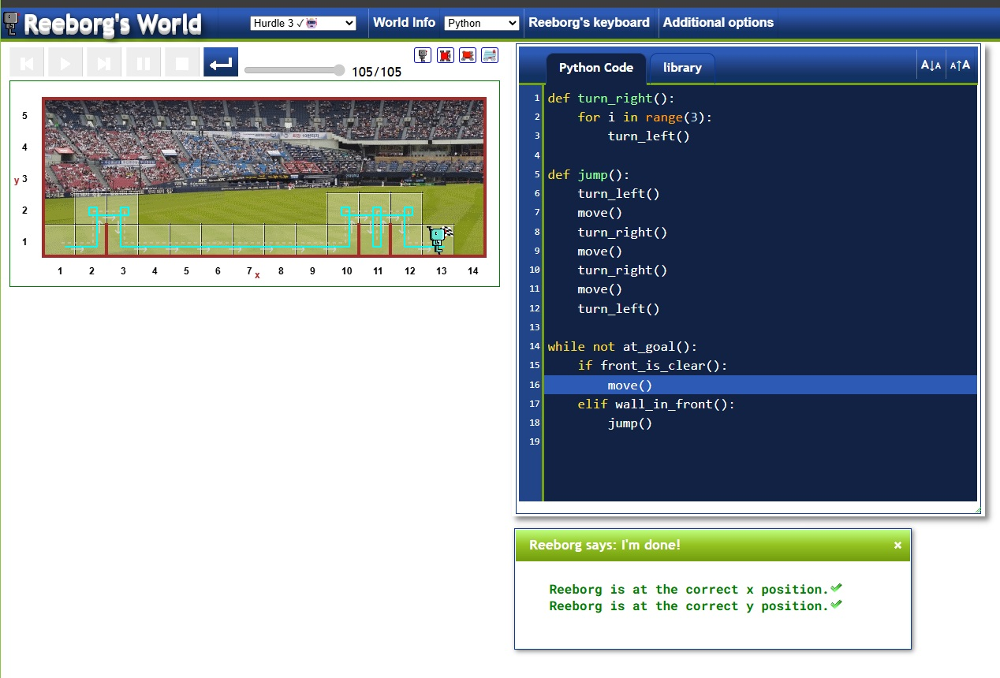
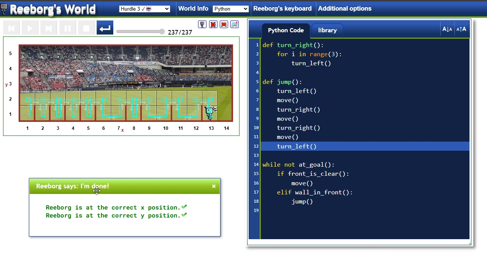
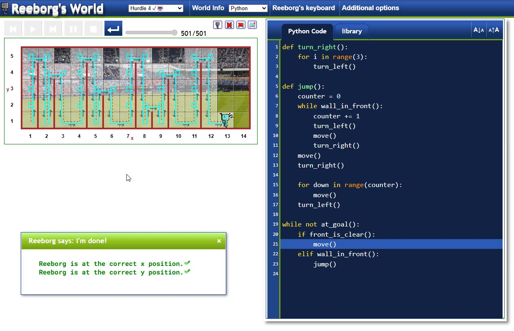
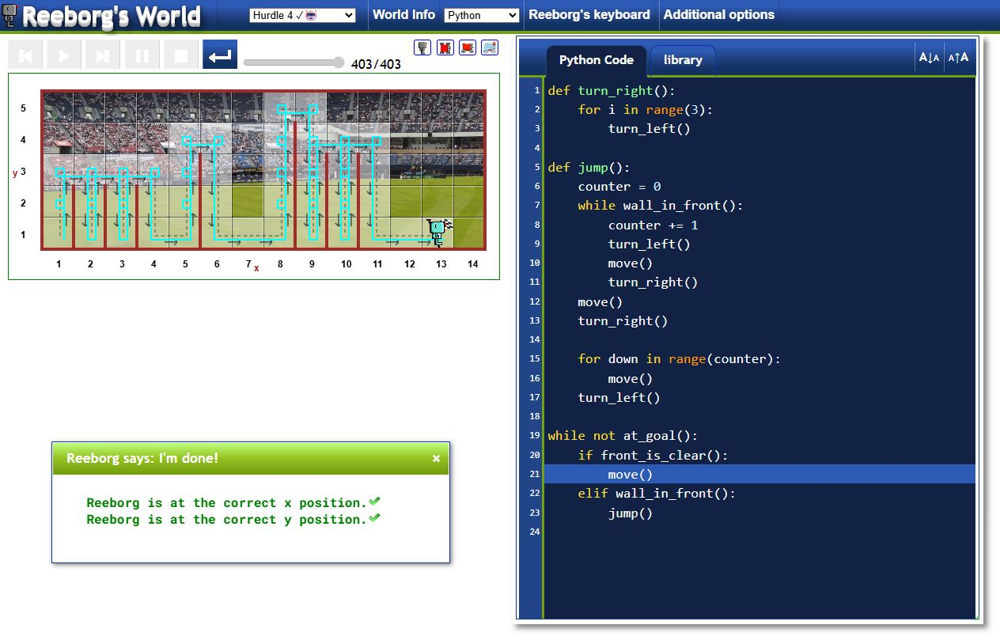

# Reeborg's World: Hurdle Challenges

This directory contains my Python solutions for the **Hurdle 3** and **Hurdle 4** challenges in [Reeborg's World](https://reeborg.ca/reeborg.html).

## Project Overview
Reeborg's World is a puzzle game where you control a robot using Python. A very fun way to test the basic building blocks of a programming language and see the results in the form of a game

---

## 🏃 Hurdle 3
In this challenge, hurdles are placed at random intervals. The robot must move forward and jump only when it detects a wall in front of it.

### Hurdle 3 Showcase
| Scenario 1 | Scenario 2 | Scenario 3 |
| :---: | :---: | :---: |
|  |  |  |

**Solution:** [Hurdle3.py](./Hurdle3.py)  
**Play:** [Hurdle 3 Level](https://reeborg.ca/reeborg.html?lang=en&mode=python&menu=worlds%2Fmenus%2Freeborg_intro_en.json&name=Hurdle%203&url=worlds%2Ftutorial_en%2Fhurdle3.json)

---

## 🏔️ Hurdle 4
Hurdle 4 is significantly more difficult because the **height of the hurdles is random**. The robot must "climb" until it finds the top of the wall, move across, and descend back to the floor.

### Hurdle 4 Showcase
| Scenario 1 | Scenario 2 |
| :---: | :---: |
|  |  |

**Solution:** [Hurdle4.py](./Hurdle4.py)  
**Play:** [Hurdle 4 Level](https://reeborg.ca/reeborg.html?lang=en&mode=python&menu=worlds%2Fmenus%2Freeborg_intro_en.json&name=Hurdle%204&url=worlds%2Ftutorial_en%2Fhurdle4.json)