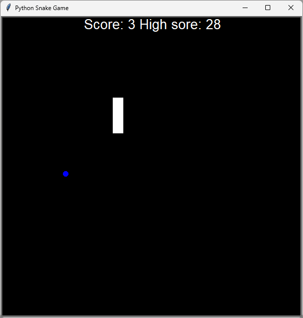

# Classic Snake Game 🐍

This project is part of the "100 Days of Code: The Complete Python Pro Bootcamp." It is a classic arcade Snake Game built using Python's `turtle` graphics library. This project focuses on more advanced Object-Oriented Programming (OOP) concepts, inheritance, and screen animation control.

## Project Overview
The player controls a snake that grows longer each time it eats a piece of food. The goal is to get the highest score possible without hitting the walls or the snake's own tail.

## Features
- **Smooth Animation:** Uses `screen.tracer(0)` and `screen.update()` for fluid movement.
- **Score Tracking:** A real-time scoreboard that updates every time food is consumed.
- **Collision Detection:** Logic to detect collisions with food, walls, and the snake's tail.
- **Classic Controls:** Responsive movement using the arrow keys.
- **OOP Architecture:** Clean code separation into specialized classes.

## Printscreen
Below is a visual representation of the game in action:

http://googleusercontent.com/image_collection/image_retrieval/18086382063929146495_0

## File Structure
- `main.py`: The main game loop and screen setup.
- `snake.py`: The `Snake` class managing the body segments, movement, and direction logic.
- `food.py`: The `Food` class (inherits from `Turtle`) that spawns food at random locations.
- `scoreboard.py`: The `Scoreboard` class (inherits from `Turtle`) that manages the score display and "Game Over" message.