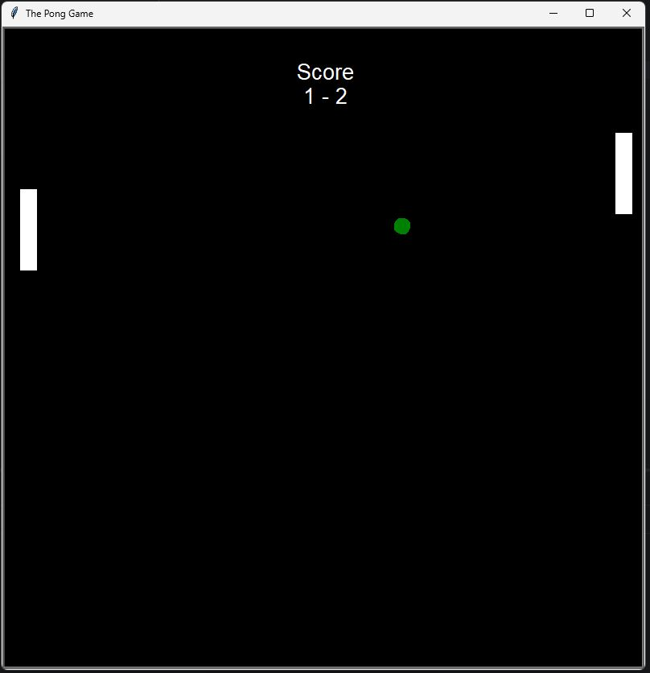

# Python Pong Game

A modern recreation of the legendary 1972 Atari classic. This project is a 2D sports simulation built to demonstrate basic game physics, collision detection, and GUI handling using Python.

## 🕹️ About the Game
Pong is one of the earliest arcade video games. It mimics table tennis where players control vertical paddles to hit a ball back and forth. This version stays true to the minimalist aesthetic while running on modern hardware.

## 🚀 Features
* **Classic 2D Graphics:** Built using the Python `turtle` graphics library.
* **Real-time Interaction:** Smooth paddle movement using keyboard listeners.
* **Score Tracking:** Automatic score updates when a player misses the ball.
* **Increasing Difficulty:** The ball speeds up after every paddle hit.

## 🛠️ Built With
* **Language:** Python 3.x
* **Library:** `turtle` (Standard Python Graphics)