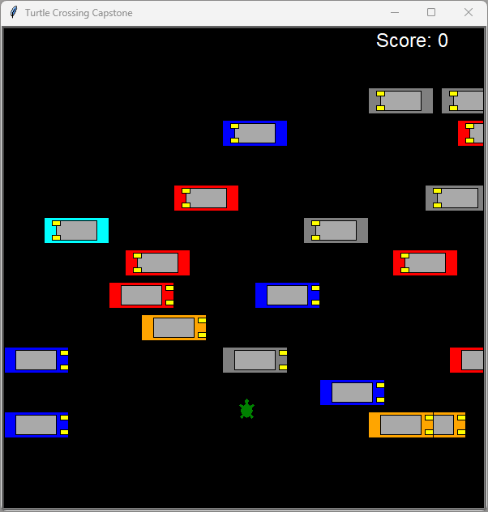

# Turtle Crossing Capstone Project 🐢🚗

This project is part of the "100 Days of Code: The Complete Python Pro Bootcamp." It is a modern, simplified take on the classic arcade game *Frogger*, built using Python's built-in `turtle` graphics library.

## Project Overview
The objective is to guide a turtle across a busy highway filled with randomly generated cars. Every time the turtle successfully reaches the finish line at the top:
1. The turtle resets to its starting position.
2. The movement speed of the cars increases.
3. The level counter on the scoreboard increments.

The game ends immediately if the turtle is hit by a car.

## Key Features
* **Player Control:** Simple keyboard interaction using the `Up` arrow key.
* **Procedural Car Generation:** Cars are spawned at random positions on the y-axis and move across the screen.
* **Increasing Difficulty:** The game gets progressively faster as the player levels up.
* **OOP Design:** The project is built using Object-Oriented Programming principles, with separate classes for the player, car management, and the scoreboard.

## File Structure
* `main.py`: The heart of the game. It manages the screen setup, the game loop, and event listeners.
* `player.py`: Contains the `Player` class, which handles the turtle's movement and resets.
* `car_manager.py`: Manages the generation, movement, and speed logic of the enemy cars.
* `scoreboard.py`: Handles the visual display of the current level and the "GAME OVER" message.

## 📸 Screenshots
