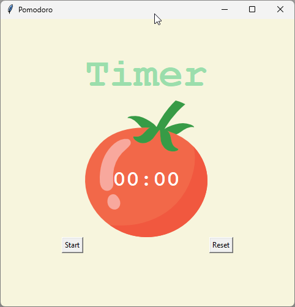
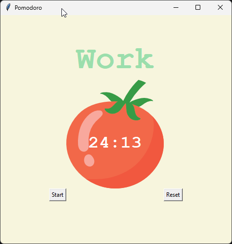
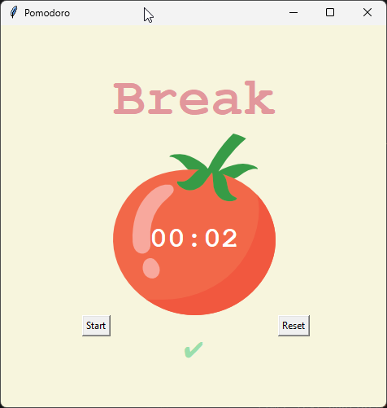
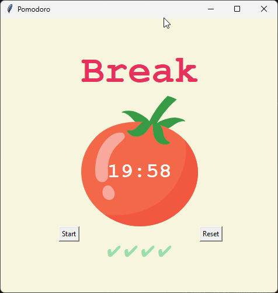

# 🍅 Pomodoro Timer

A simple desktop time-management application built with Python and the **Tkinter** library. This tool helps users stay focused and productive by automating the popular Pomodoro cycles.

---

## 🧠 What is the Pomodoro Technique?

The Pomodoro Technique is a time management method developed by Francesco Cirillo in the late 1980s. It uses a timer to break work into intervals, traditionally **25 minutes** in length, separated by short breaks.

**How this app follows the method:**
1. **Work:** 25 minutes of deep focus.
2. **Short Break:** 5 minutes to stretch or hydrate.
3. **The Cycle:** Repeat the process 4 times.
4. **Long Break:** After the 4th work session, take a longer 20-minute break.

---

## 📸 Screenshots

Here is a visual guide to the application's different states:

| **1. Initial State** | **2. Work Session** |
| :---: | :---: |
|  |  |
| *How the app looks upon launch.* | *Focused work interval (25 min).* |
| **3. Short Break** | **4. Long Break** |
|  |  |
| *Quick 5-minute recovery.* | *Extended 20-minute break.* |

---

## ✨ Features

* **Automated Transitions:** The app automatically switches between work, short breaks, and long breaks.
* **Visual Progress Tracker:** Checkmarks (`✔`) appear automatically after every completed work session.
* **Dynamic UI:** The title and colors change based on the current state (Work/Break).
* **Precise Time Formatting:** Uses advanced f-string formatting to ensure a consistent `00:00` display.