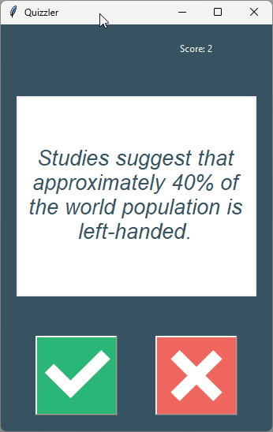

# Quizzler App

## Project Description

The **Quizzler App** is a professional-grade quiz application built with Python. This project focuses on utilizing the **Open Trivia Database API** to fetch dynamic questions, implementing a **Graphical User Interface (GUI) with Tkinter**, and practicing **Class-based programming**.

The application challenges users with true/false questions, tracks the score in real-time, and provides visual feedback for correct or incorrect answers.

## Preview
 
## Features

  * **Dynamic Questions:** Fetches 10 random true/false questions from an external API.
  * **User Interface:** A clean and modern GUI built with the `tkinter` library.
  * **Score Tracking:** Keeps track of the user's current score throughout the session.
  * **Visual Feedback:** The interface flashes green for correct answers and red for incorrect ones.
  * **OOP Structure:** Fully written using Object-Oriented Programming principles for better code organization and scalability.

## Technologies Used

  * **Python 3**
  * **Tkinter:** For the graphical user interface.
  * **Requests Module:** To handle API calls to the Open Trivia Database.
  * **HTML Entities:** To unescape and format the text received from the API.

## Files in this Directory

  * `main.py`: The entry point of the application.
  * `ui.py`: Contains the `QuizInterface` class responsible for the GUI.
  * `quiz_brain.py`: Contains the logic for managing questions, checking answers, and tracking progress.
  * `data.py`: Handles the API request to fetch questions.
  * `question_model.py`: Defines the `Question` class.
  * `images/`: Directory containing UI icons and the application screenshot.
